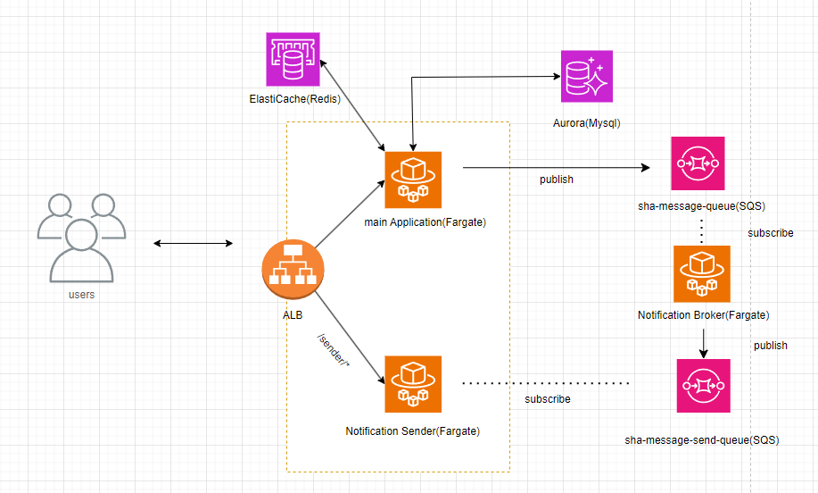
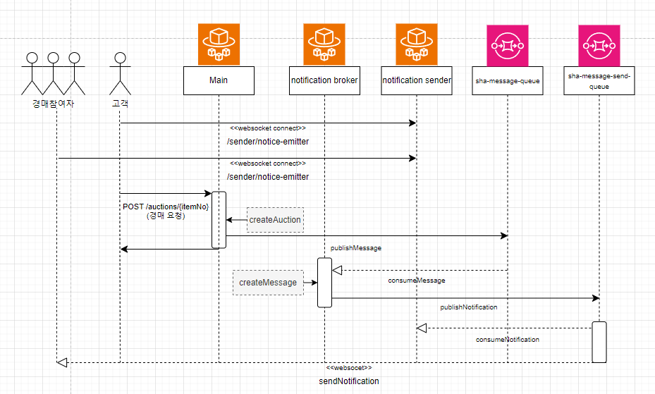
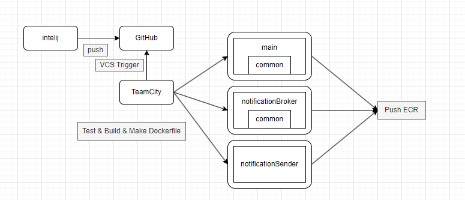

# Secondhand-Auction

## 📌 프로젝트 목표

- ```객체지향 설계원칙```에 따라 ```RESTful API``` 를 설계 합니다.


- ```TDD```개발론을 적용하며, 테스트의 중요성에 대해 학습합니다.


- ```대용량 트래픽과 동시성에 대해 고려```하며 개발합니다.


- 새로운 커밋이 발생할 때 마다 ```코드리뷰```를 통해 ```리팩토링```이 필요한 부분을 찾아내고, 개선합니다.

---

## ✏️프로젝트 특징

구현하고 싶은 기능

사용자가 참여하고 있는 경매 누군가 입찰 했을 때,
경매에 참가한 사용자들에게 새로운 입찰 발생 메시지를 보내고,
접속중인 사용자에게는 실시간으로 알림을 보내는 기능을 구현하고자 했습니다.

문제

- 새로운 입찰 발생 메시지를 보내는 작업은 DB에 접근 해 Insert 쿼리 호출 해야하고,
  실시간 알림을 발송하기 위해 Websocket 을 사용해 접속한 대상을 체크해 알람을 보내야 했습니다.
  경매 참여자가 증가할 수록, 입찰 로직 수행시간 보다 메시지와 실시간 알림을 보내기위한 대기시간이 길어졌습니다.

해결방안 및 결과

- 경매 참여자가 많아질 경우에도 입찰 로직의 수행시간을 보존하고자 멀티모듈을 활용, 입찰 로직을 수행하는 서버와 경매 알림 로직을 수행하는 서버를 분리해 수행하도록 했습니다.
    - 경매 참여자가 많아질 경우에도, 경매 등록 로직은 100ms 이내로 수행될 수 있습니다.
    - 핵심 로직(경매) 이외 문제가 발생하더라도, 메인서버의 안정성을 보장할 수 있습니다.
    - 서버 확장이 필요할 때, 트래픽이 몰리는 특정 서버에 대해서만 확장이 가능해 비용 효율성을 높일 수 있습니다.
    - 기능변경 및 개선 작업이 이루어질 때, 다른서버에 미치는 영향을 최소화할 수 있습니다.

---

문제

- 한 가지 기능을 위해, 여러개의 서버에서 작업이 이루어져야 했습니다.
- 서버가 물리적으로 결합되어 있어, 외부에서 서버의 구조를 파악할 수 있었습니다.
- 서버가 다운되거나 많은 요청이 몰리더라도, 메시지 손실이 발생할 수 있었습니다.

해결방안 및 결과

- 서버의 연결을 메시지 큐(AWS SQS)를 통해 발행, 구독 하도록 했습니다.
    - 여러 서버에서 작업이 비동기적으로 이루어 질 수 있어, 시스템의 처리량을 증가시키고 사용자에게 빠른 서비스를 제공할 수 있습니다.
    - 각 서버가 물리적 결합이 아닌 간접적으로 통신되므로, 외부에서 구조를 파악할 수 없게 해 보안적으로 안전하게 유지할 수 있습니다.
    - 서버가 다운되거나 많은 요청이 몰리더라도, 큐를 통해 메시지가 관리되어, 메세지 손실 없이 안정적으로 처리할 수 있습니다.

---

## 💡 중고거래 옥션 서버 구조도



- ```ECS Fargate```를 이용해 Main, Sender, Broker 3개의 서비스를 띄우고, ```ALB``` 설정을 통해 /sender/* 로 요청 되는 건에 대해서는 Notification
  Sender 어플리케이션으로, 나머지 요청은 Main 어플리케이션으로 요청되도록 구성했습니다.


- Redis 서버는 ```ElastiCache``` 를 활용하며, Main 서버에서의 로그인 세션 공유, 캐싱처리, 입찰 시 동시성 제어를 위한 Lock 으로 사용하고 있습니다.


- AWS SQS를 활용해 Main 서버와 Broker 서버 간의 메시지 전달, Sender 서버와 Broker 서버 간의 메시지 전달을 구현했습니다.

---

## 📌 경매요청 시퀀스 다이어그램



- 로그인 시, 고객은 Sender 서버와 ```Websocket``` 을 통해 연결상태를 유지합니다.


- 고객이 입찰 시, Main 서버에서는 해당 요청을 받아 입찰로직을 수행하고, AWS SQS(sha-message-queue)에 경매 정보 메시지를 Publish 합니다.


- Broker 서버에서는 AWS SQS(sha-message-queue)에 메시지를 받았을 때, 경매 참여자의 메시지함에 메시지를 추가하고, 알람을 위한 정보를 AWS SQS(
  sha-message-send-queue) 로 Publish 합니다.


- Sender 서버에서는 AWS SQS(sha-message-send-queue)에 메시지를 받았을 때, Websocket 을 통해 실시간 알람을 전송합니다.

---

## 📌 Secondhand-Auction 어플리케이션 및 CI/CD 구조도



- 프로젝트의 역할을 분리하기 위해 멀티모듈을 사용했습니다. 공통적으로 사용되는 기능들을 common 모듈로 구분한 뒤 해당 모듈을 사용해 main과 broker 어플리케이션을 구성했고, 실시간 알람을 위한
  Sender는 따로 어플리케이션을 구성했습니다.


- ```TeamCity``` 의 ```VCS Trigger``` 를 통해 Github Main 브런치의 커밋 이벤트를 감지하고, 해당 이벤트에 대해 빌드 및 테스트를 진행 후 Docker 이미지를 구성해 ECR로
  업로드합니다.


- 업로드 된 Docker 이미지를 ```ECS Fargate``` 에 배포하고, ```ALB``` 를 통해 서비스를 제공합니다.

---